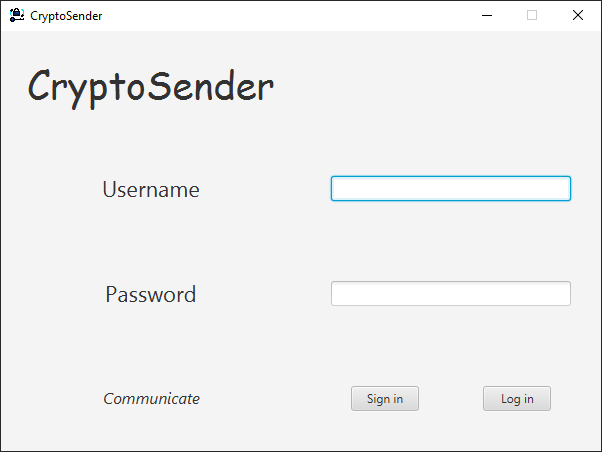
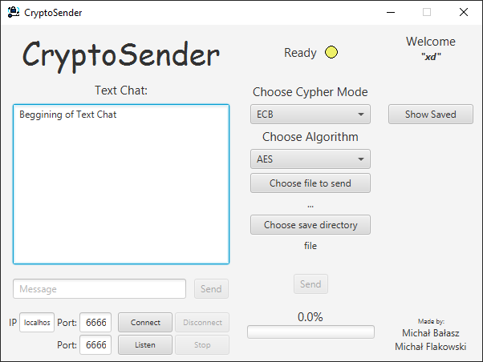
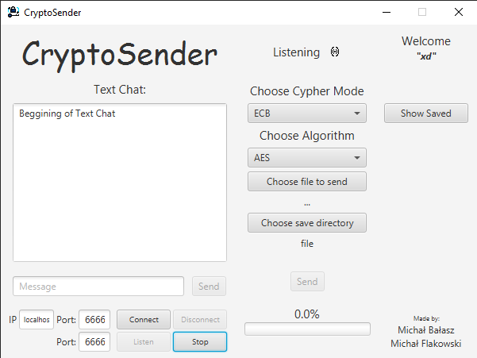
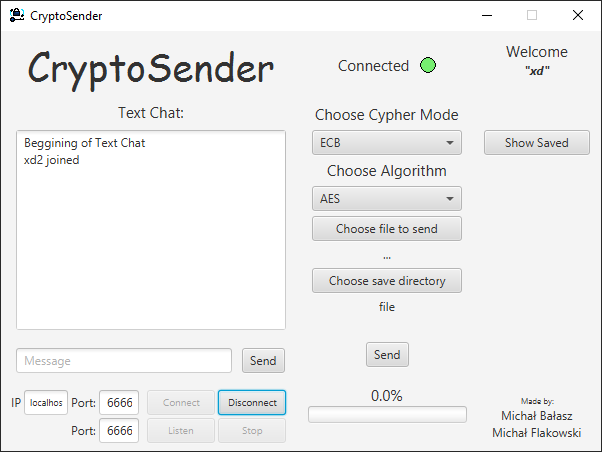
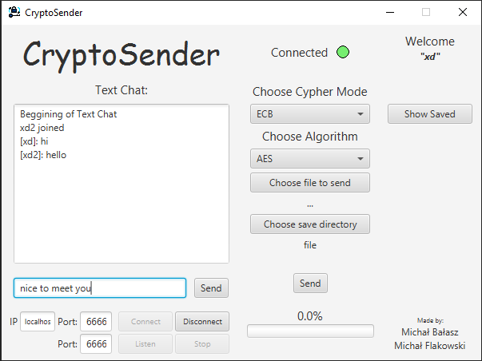
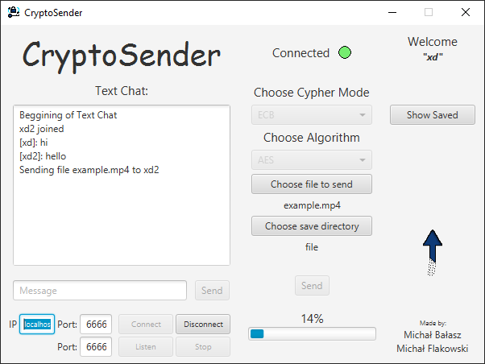
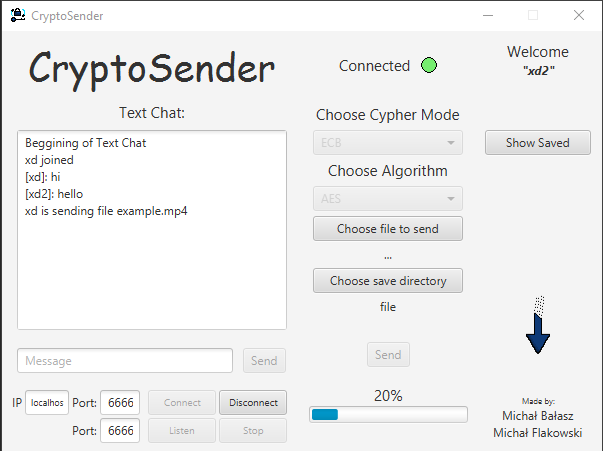
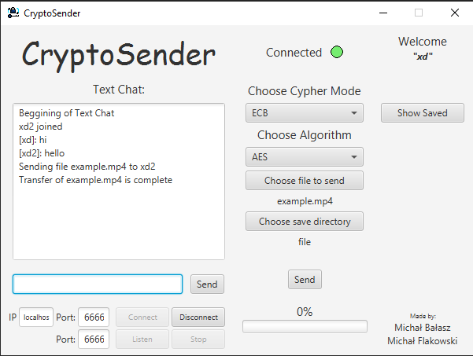
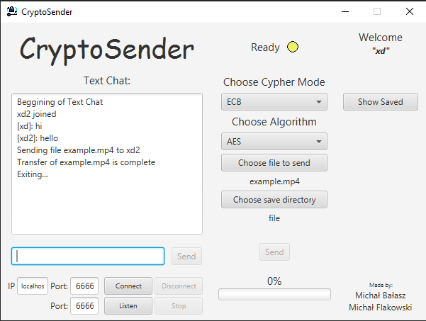

# Studies project - Encrypted p2p communicator

## Collaboration:
- The project was created in cooperation with [**@Majkelevsky**](https://github.com/Majkelevsky/)

## About:
- Simple communicator based on TCP sockets.
- Multiple user accounts and automatically generated public and private RSA keys (stored locally in encrypted form).
- Fully encrypted message and file exchange between clients.
- AES, 3DES and DES transformations in ECB and CBC modes.
- Functional user GUI.

## Used technologies:
- TCP sockets
- Java Crypto
- JavaFX

## Communication scheme:
- After successful tcp connection, both clients establish communication by exchanging their usernames and public keys 
(using simple challenge / response mechanism).
- For each encryption settings alteration new session is established by exchanging session information and symmetric
key encrypted using RSA.
- One communication can hold many sessions.
- Once session is established, all data exchanged between clients is encrypted.

## Presentation:
- Sign in / Log in screen:

- Main communicator window after successful login:

- One client (or both) start to listen for connections on desired port:

- Other client connects to a given ip and port, if successful connection will be established:

- From now on both clients can exchange chat messages:

- As well as send and receive files:

- When finished clients can disconnect from chat or simply close the application:

